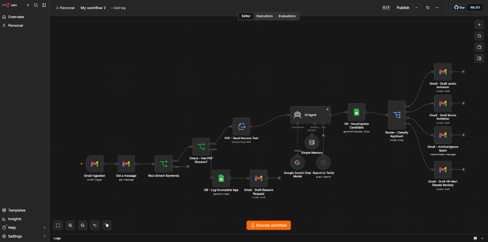

# 🤖 AI Recruiter Agent: End-to-End Recruitment Automation with n8n

A production-grade recruiter AI agent built using **n8n**, **Google Gemini (1.5 Flash)**, and **Google Sheets** that automates the screening of incoming resumes from Gmail, filters spam, logs candidate data, and drafts customized responses.

---

## 🎯 Features
*   **Smart Pre-AI Spam Filter**: Blocks promotional emails and newsletters based on keywords and attachment presence before hitting the Gemini API (reducing token costs).
*   **PDF Resume Extraction & Verification**: Ingests candidate resumes in PDF format, verifying that the filename contains keywords like `resume` or `cv` to avoid processing unrelated files, and parses the text contents to structure the profile with AI.
*   **Duplicate Candidate Prevention (Upsert)**: Replaces standard row appending with an Upsert action, updating existing rows by matching candidates' email addresses (`Contact`).
*   **Awaiting Resume Handler**: If a candidate emails without a resume attachment, the system logs their status as `Incomplete - No Resume` and drafts an automated follow-up email.
*   **24/7 Cloud Run Execution**: Hosted on Railway to run the n8n automation engine constantly in the cloud, processing applications in real-time even when local machines are shut down.
*   **4-Route Router**: Classifies candidates and creates tailored email drafts in Gmail using precise Google Sheets field matching:
    *   `Route 0 (Junior)`: Fresh Grad invitation containing candidate name, course, and university (Thread ID enabled).
    *   `Route 1 (Senior)`: Technical interview invitation containing candidate name and parsed technical skills (Thread ID enabled).
    *   `Route 2 (Spam)`: Awtomatikong archiver for non-recruitment spam emails.
    *   `Route 3 (Needs Review)`: Alerts HR (emailing `lipalambenjie@gmail.com`) with candidate details, summary, and contact information for manual review.

---

## 📐 Workflow Architecture



---

## 💡 Key Debugging Insights (Lessons Learned)

During build testing and integration validation, I resolved several core issues that are documented in the project journal:
*   **Fragile Field-Key Coupling**: Every downstream Gmail draft node hard-coded Sheet column names (including trailing colons like `Name:` or `Skills:`). A single schema difference between the AI Agent output and Sheets would silently break variables. I normalized all expressions and the Gemini JSON schema to maintain identical keys throughout the pipeline.
*   **Thread ID Alignment**: Aligned Gmail thread responses using `{{ $('Gmail Ingestion').item.json.id }}` to keep draft invites neatly threaded under the candidate's original email.

---

## 🛠️ Project Structure
*   `index.html`: The HTML structure of the project build case study (designed as a premium documentation page).
*   `portfolio.css`: Decoupled custom styling for the portfolio page (dark slate layout with custom interactive details).
*   `assets/`: Local screenshots of n8n parameters, debugging logs, and execution outputs.

---

## 🔧 Installation & Local Setup

### 1. View the Portfolio Locally
Simply open the `index.html` file in any browser to view the interactive project journal:
```bash
# Open using explorer on Windows
explorer.exe index.html
```

### 2. Import the n8n Workflow
1. Download or export the workflow JSON from n8n.
2. In your n8n workspace, click **Add Workflow** ➡️ **Import from File** and select the JSON file.
3. Configure your node credentials (Gmail OAuth2, Gemini API Key, Google Sheets OAuth2).

---

## 💡 Developer
Built by **[Benjie Lipalam](https://github.com/your-username)** as a showcase of agentic AI workflow automation and low-code integrations.
